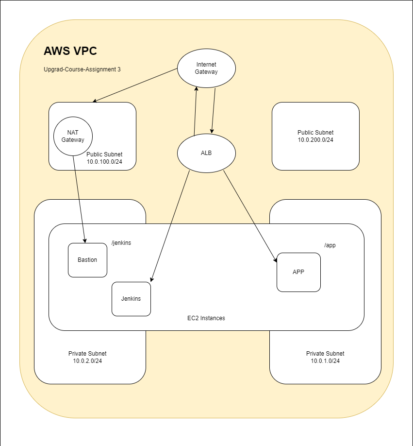

# [Upgrad DevOps Course Assignment 3](https://github.com/kulterryan/upgrad-devops-terraform/tree/master)
## Cohort 3100
This is the Course Assignment for the module of **CI/CD Pipelining, Kubernetes and Configuration**.

### Task Accomplished
- Created S3 Storage "upgrad-assignment-aryn" for storing Terraform Backend States.
- Deployed AWS Security Groups for EC2 Instances and ALB using Terraform.
- Deployed 3 AWS EC2 Instances: Apps, Bastion, Jenkins using Terraform.
- **[BONUS]** Deployed AWS Automatic Load Balancers using Terraform.
- Configured Ansible Inventory for Hosts - App, Jenkins, and Bastion.
- Created Playbook file _**Setup.yml**_ to Install Docker on Jenkins and App EC2 Instances.
- Installed Jenkins manually on EC2 Instances using  Ansible Playbook.
- Created ECR Repository for Docker Image of Node App.
- Build Jenkins Pipelines for deploying the app.
- Coded Docker File for Node Alpine app.

### How does it work?

1. Install & Configure AWS CLI & Terraform.
2. Clone the [Github Repository](https://github.com/kulterryan/upgrad-devops-terraform/tree/master).
3. Initailize Terraform State in the Directory.
4. Validate Terraform Codes using command `terraform validate`.
5. Use `terraform apply` to create the infrastructure on AWS
6. Install _Docker_ using the `setup.yml` Ansible Playbook in `\ansible-playbook` directory.
7. Get the Public URL on Application Load Balancer.
8. Use `https://<PUBLICURL/>:80/jenkins` to start the **Jenkins EC2 Instance** using Application Load Balancer.
9. Build a pipeline in Jenkins.

#### How to Build Pipeline in Jenkins?

- Create a New Item in Jenkins.
- Enter pipeline details.
- Configure the parameters of Jenkins Pipeline.
- Use SCM as "GIT" and enter the sample url of Docker Sample Code Repository.
- Configure the credentials of Github.
- Deploy the Jenkins Pipeline.
- The Node App will be successfully deployed on the URL: `https://<PUBLICURL/>:80/app` to start the app.

10. After succesfully deploying the App. We can destroy the entire AWS Infrastructure coded via Terraform by running: `terraform destroy`.

**[⚠️ NOTE]**
Terraform Destroy will completely wipeout the resources and services that were created using Terraform.

### Sample Code Repository

**[Github Repository of Docker Sample Codes](https://github.com/kulterryan/upgrad-assignment-sample)**

### BONUS
- **[Link to Cost Estimation](https://docs.google.com/document/d/1bNOi5jvkiHIQmiFW_1Lpl65wco0x2oxEK9sxaXPjljs/edit?usp=sharing)**

- **AWS VPC Architecture Map**

### SCREENSHOTS
- **[Link to Google Drive](https://drive.google.com/drive/folders/1rfZkF52Y00Sy_B2OYM204HkMOAvk6ySV?usp=share_link)**

### THANKS
**[ARYAN CHAURASIA](https://github.com/kulterryan)**